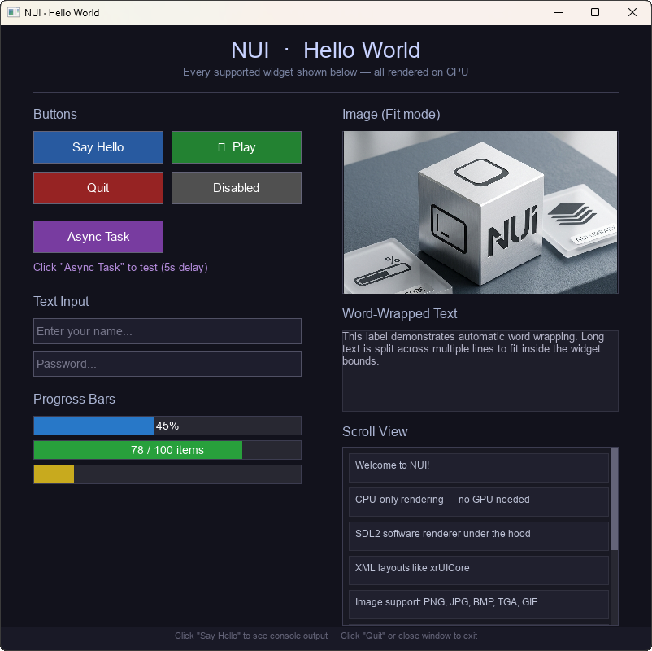

# NUI



Лёгкий кроссплатформенный UI toolkit для десктоп-приложений, вдохновлённый архитектурой xrUICore.

## Особенности

- **Только CPU рендеринг** — не требует GPU, дискретной видеокарты или драйверов
- **Один бинарник** — статическая линковка всех зависимостей
- **Кроссплатформенность** — Windows, Linux, macOS
- **Маленький размер** — ~3-5 МБ итоговый бинарник
- **XML layouts** — описание UI в XML файлах (аналогично xrUICore)
- **Поддержка изображений** — PNG, JPG, BMP, TGA, GIF через stb_image
- **Асинхронные задачи** — ThreadPool + Future с dispatch на main thread

## Быстрый старт

### Требования

- **Git** — для клонирования с submodule'ами
- **CMake 3.16+** — для сборки зависимостей
- **Windows**: Visual Studio 2019/2022 с компонентом "Desktop development with C++"
- **Linux**: GCC 9+ или Clang 10+, `libx11-dev` и связанные пакеты
- **macOS**: Xcode Command Line Tools

### Шаг 1: Клонировать

```bash
git clone --recursive https://github.com/your-org/nui.git
cd nui
```

### Шаг 2: Первичная настройка (один раз)

| ОС | Команда |
|----|---------|
| **Windows** | `setup.bat` |
| **Linux / macOS** | `chmod +x setup.sh && ./setup.sh` |

Скрипт делает:
- Инициализирует git submodules (SDL2, SDL_ttf, pugixml)
- Переключает на нужные теги релизов
- Скачивает stb_image.h если его нет

### Шаг 3: Собрать

**Windows (Visual Studio):**
```bash
nui.sln          # открыть в VS
# Release | x64 → Build → Build Solution (Ctrl+Shift+B)
```

**Windows (CMake):**
```bash
cmake -B build -G "Visual Studio 17 2022" -A x64
cmake --build build --config Release
```

**Linux / macOS (CMake):**
```bash
cmake -B build -DCMAKE_BUILD_TYPE=Release
cmake --build build -j$(nproc)
```

> **Windows:** Всегда указывайте `-G "Visual Studio 17 2022"` иначе CMake может выбрать GCC из Strawberry Perl или MinGW.

### Шаг 4: Запустить

```
build\bin\Release\nui-example.exe
```

Или через VS: **Debug → Start Without Debugging** (Ctrl+F5).

> Ресурсы (картинки, XML) копируются рядом с exe автоматически через PostBuildEvent.

## Структура проекта

```
nui/
├── nui.sln                     ← VS Solution (собирает всё через .vcxproj)
├── nui.vcxproj                 ← VS: статическая библиотека NUI
├── setup.bat                   ← Настройка Windows (submodules + теги + cmake)
├── setup.sh                    ← Настройка Linux / macOS
├── CMakeLists.txt              ← Корневой CMake (альтернатива .sln)
│
├── Externals/                  ← Git submodules (зависимости)
│   ├── SDL2/                   ←   SDL2 2.30 (окно, ввод, software renderer)
│   ├── SDL_ttf/                ←   SDL_ttf 2.22 (шрифты через FreeType)
│   ├── pugixml/                ←   pugixml 1.14 (XML парсер)
│   ├── SDL2_proj/              ←   .vcxproj для SDL2 (генерируется)
│   ├── SDL_ttf_proj/           ←   .vcxproj для SDL_ttf + freetype
│   └── pugixml_proj/           ←   .vcxproj для pugixml
│
├── src/                        ← Исходники NUI библиотеки
│   ├── core/
│   │   ├── application.h/cpp   ← Главное окно, event loop
│   │   ├── input.h/cpp         ← Состояние мыши/клавиатуры
│   │   ├── async.h/cpp         ← ThreadPool + Future + main thread dispatch
│   │   └── log.h               ← Логирование (stdout + OutputDebugString)
│   ├── renderer/
│   │   ├── canvas.h/cpp        ← CPU 2D рендеринг (SDL_Surface)
│   │   ├── color.h             ← RGBA цвет
│   │   ├── texture.h/cpp       ← Загрузка изображений (stb_image)
│   │   ├── font.h/cpp          ← Рендеринг шрифтов (SDL_ttf/FreeType)
│   │   └── resource.h/cpp      ← ResourceManager (embedded + filesystem)
│   ├── ui/
│   │   ├── widget.h/cpp        ← Базовый виджет (как CUIWindow)
│   │   ├── label.h/cpp         ← Текстовая метка
│   │   ├── button.h/cpp        ← Кнопка с hover/press состояниями
│   │   ├── image.h/cpp         ← Отображение картинок (5 режимов масштабирования)
│   │   ├── editbox.h/cpp       ← Поле ввода (UTF-8, backspace, стрелки)
│   │   ├── progressbar.h/cpp   ← Индикатор прогресса
│   │   └── scrollview.h/cpp    ← Прокручиваемый контейнер + scrollbar
│   └── xml/
│       └── layout_loader.h/cpp ← XML → дерево виджетов
│
├── examples/
│   └── app/                    ← Пример-приложение
│       ├── CMakeLists.txt
│       ├── main.cpp            ← Все виджеты + async demo
│       └── layout.xml          ← XML layout
│
├── resources/                  ← Ресурсы (вшиваются в бинарник)
│   ├── fonts/
│   ├── images/
│   └── layouts/
│
└── tools/
    └── embed_resources.py      ← Скрипт вшивания ресурсов в exe
```

## Архитектура

```
SDL2 (окно + ввод + software renderer)
  └─ Canvas (CPU 2D рендеринг)
       ├─ FillRect, DrawRect, DrawLine, DrawPixel
       ├─ DrawTexture (stretch, fit, fill, center, tile)
       └─ DrawText, DrawTextWrapped (SDL_ttf / FreeType)
  └─ UI Kit (виджеты)
       ├─ Widget (базовый класс, как CUIWindow)
       ├─ Label, Button, Image, EditBox, ProgressBar, ScrollView
       └─ LayoutLoader (XML → дерево виджетов)
  └─ Async
       ├─ ThreadPool (N-1 воркеров)
       ├─ Future<T> с Then() на main thread
       └─ Application::DispatchOnMainThread()
```

## Использование в своём проекте

### CMakeLists.txt

```cmake
cmake_minimum_required(VERSION 3.16)
project(my-launcher LANGUAGES CXX)
set(CMAKE_CXX_STANDARD 17)

add_subdirectory(nui)

add_executable(${PROJECT_NAME} WIN32 src/main.cpp)
target_link_libraries(${PROJECT_NAME} PRIVATE nui)
```

### main.cpp

```cpp
#include "core/application.h"
#include "core/async.h"
#include "renderer/resource.h"
#include "xml/layout_loader.h"
#include "ui/button.h"

int main() {
    nui::ResourceManager::Initialize();

    nui::Application app;
    app.Initialize({"My Launcher", 1024, 768});

    nui::TextureCache textures;
    nui::LayoutLoader loader;
    nui::FontManager fonts;
    fonts.Initialize();

    auto root = loader.LoadFromFile("resources/layouts/main.xml", textures, fonts);

    root->GetChild("btn_play")->SetOnClick([](nui::Widget*) {
        nui::Async::Run([]() {
            return launchGame();
        })->Then([](bool ok) {
            if (!ok) nui::GetApp()->Quit();
        });
    });

    app.SetRoot(std::move(root));
    return app.Run();
}
```

### layout.xml

```xml
<layout width="1024" height="768" bg_color="20,20,30">
    <image x="0" y="0" width="1024" height="400"
           src="resources/images/background.jpg" scale="fill"/>
    <button name="btn_play" x="400" y="500" width="224" height="60"
            text="PLAY" font_size="24"
            bg_color="40,160,60" hover_color="50,190,70"/>
</layout>
```

## Виджеты

| XML тег | Класс | Описание |
|---------|-------|----------|
| `<layout>`, `<panel>` | Widget | Контейнер |
| `<label>`, `<text>` | Label | Текст (word-wrap, выравнивание) |
| `<button>` | Button | Кнопка (hover, press, onClick) |
| `<image>`, `<sprite>` | Image | Картинка (stretch, fit, fill, center, tile) |
| `<editbox>`, `<input>` | EditBox | Ввод текста (UTF-8, backspace, стрелки) |
| `<progressbar>`, `<progress>` | ProgressBar | Индикатор прогресса |
| `<scrollview>`, `<scroll>` | ScrollView | Прокрутка + scrollbar |

### Общие свойства XML

Все виджеты: `name`, `x`, `y`, `width`, `height`, `visible`, `enabled`,
`bg_color`, `border_color`, `color`, `align_h`, `align_v`

## Async API

```cpp
// Фоновая задача → результат на main thread
nui::Async::Run([]() {
    return heavyComputation();  // на воркере
})->Then([](int result) {
    label->SetText(std::to_string(result));  // на main thread
});

// Dispatch на main thread из любого потока
nui::Application::DispatchOnMainThread([]() {
    progressBar->SetValue(1.0f);
});
```

## Вшивание ресурсов

Ресурсы вшиваются в exe автоматически при Release сборке:

```bash
# Ручной запуск (обычно не нужен)
python tools/embed_resources.py resources/ src/generated/ resources
```

- `ResourceManager::Load(path)` ищет сначала в embedded, потом на диске
- Texture, Font, LayoutLoader автоматически используют ResourceManager

## Сравнение с другими решениями

| Решение | Размер | CPU-only | Один бинарник | Cross-platform |
|---------|--------|----------|---------------|----------------|
| **NUI** | ~3-5 МБ | ✅ | ✅ | ✅ |
| Electron | ~150 МБ | ❌ | ❌ | ✅ |
| Tauri | ~5 МБ + WebView | ❌ | ❌ | ✅ |
| Qt | ~30-50 МБ | ❌ | ❌ | ✅ |
| FLTK | ~1-3 МБ | ✅ | ✅ | ✅ |
| Dear ImGui + SW | ~1-3 МБ | ✅ | ✅ | ✅ |

## Лицензия

MIT License — см. [LICENSE](LICENSE)
